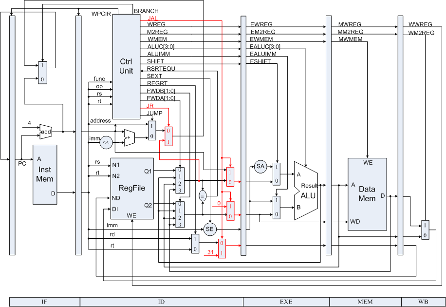
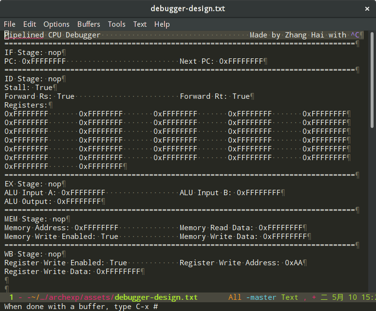
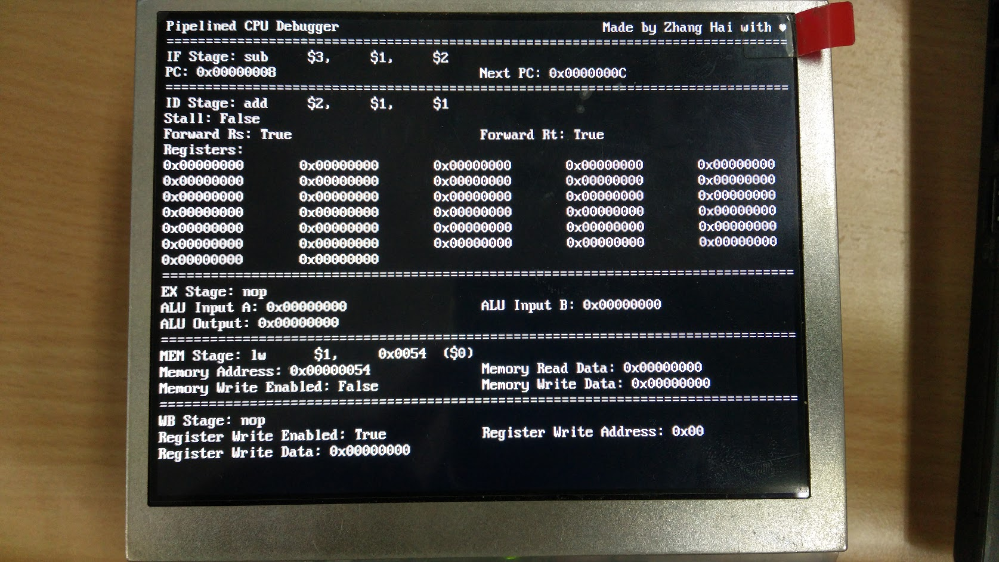
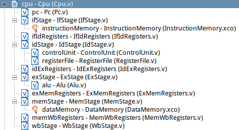
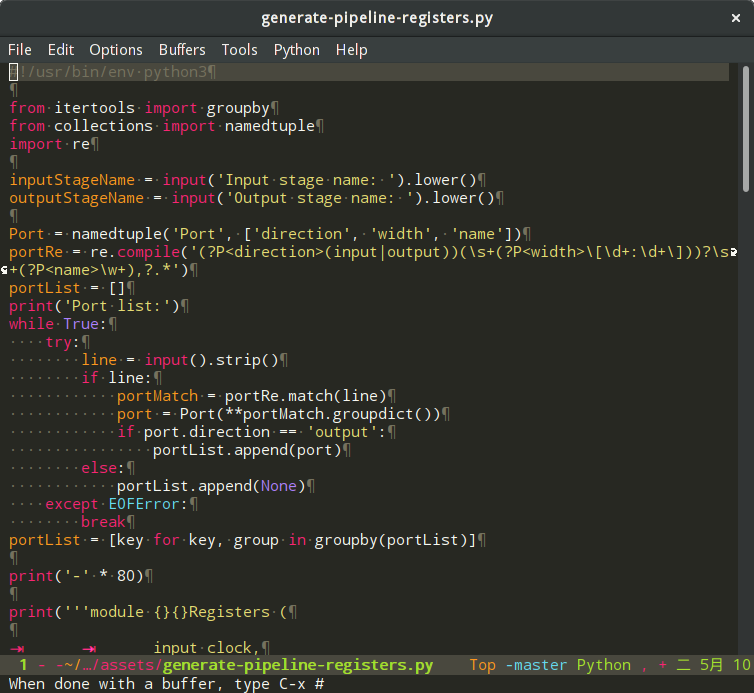

# 浙江大学计算机体系结构课程实验

张海

本项目是我按照课程要求独立完成的 MIPS 流水线 CPU 实现。目前已实现 31 条指令和 Stall/Forwarding。

本项目的开发使用 Nexys 3 开发版进行，但应当可以很简单地移植到其他开发板。

本项目的二进制 .bit 文件可以在 [Releases](https://github.com/DreaminginCodeZH/archexp/releases/) 中下载。

## 原因

课程提供的代码在结构、命名和排版上都有诸多不清晰和不一致之处，使得编码和调试时很不舒服。

- 命名不统一：大部分线路名采用模块名作为前缀以指示归属，但仍有部分代码存在问题。线路名称中有些前缀后加`_`区别，有些不加，命名不一致。模块对内和对外的线路命名可以不同，但有时加前缀，有时不加，难以一眼确定线路归属，令人困惑。

- 结构不清晰：流水线寄存器本来应当与各个执行阶段在同一个级别之上，按顺序依次传递数据。但是，代码中将流水线寄存器放在执行阶段模块的代码之中，这正是使得变量命名混乱和代码逻辑不清晰的根源。同时，甚至有将某个多路选择器逻辑放置在流水线寄存器模块代码之中的做法，这令我很难接受。

因此，我选择了自己重新实现。

至于选择开源，是想要给这门课程的实验提供一份清晰且一致的代码实现，也希望能够有助于同学们更加直观地理解流水线 CPU 的具体实现。

> 希望前人所走过的弯路后人都不必再走，这是我对开源的信念之一。

## 特点

- 基于课程提供的电路原理图，符合课程要求和实践。原线路命名与项目中线路命名对应关系在执行阶段模块的声明中以注释的方式给出。

    

- 使用 VGA 显示大量调试信息。

    得益于 VGA 较大的信息量，可以将许多有利于调试或教学的信息都打印在屏幕上实时更新。利用一个组合电路的反汇编器，可以看到当前阶段正在执行指令的汇编源代码。VGA 模块中控制显示相关的长段代码也由 Python 脚本生成，可以通过读取用文本文档记录的设计，快速进行修改。

    

    

- 合理的代码组织方式。

    在 CPU 模块之下，PC、各个流水线寄存器和各个执行阶段模块依次连接，尽力实现代码组织的合理和明确。

    

- 统一的代码风格和排版。

    经过权衡，项目代码采用了较长的命名，是为了将原本意义不明显、需要常常查看注释或原理图的变量名称，转变为清晰、不容易出错的名称，由此项目编码过程中未出现过代码逻辑错误。

    命名规则的统一使得线路功能和归属清晰可靠，而代码中的缩进、空行分块和前后顺序等排版也尽量追寻体现代码之间的逻辑关系，便于阅读和维护。

    项目代码始终尽量采用推荐的 Verilog 实践，例如新的模块声明方式。

- 自动生成部分模块和模块连线代码。

    得益于统一的命名风格和代码组织，流水线寄存器模块和各模块之间连线的代码可以按照特定规则生成。本项目采用 Python 脚本完成了数百行的代码生成，避免大量繁杂和容易出错的工作，同时由此以后修改接口时也可以更为简单。

    

    本项目中大部分代码逻辑都在 `*Stage.v` 中，而 `*Registers.v` 和 `Cpu.v` 均为生成的代码。

## 许可

```
Copyright (c) 2016 Zhang Hai <dreaming.in.code.zh@gmail.com>

This program is free software: you can redistribute it and/or modify
it under the terms of the GNU General Public License as published by
the Free Software Foundation, either version 3 of the License, or
(at your option) any later version.

This program is distributed in the hope that it will be useful, but
WITHOUT ANY WARRANTY; without even the implied warranty of
MERCHANTABILITY or FITNESS FOR A PARTICULAR PURPOSE.  See the GNU
General Public License for more details.

You should have received a copy of the GNU General Public License
along with this program.  If not, see
<http://www.gnu.org/licenses/>.
```
